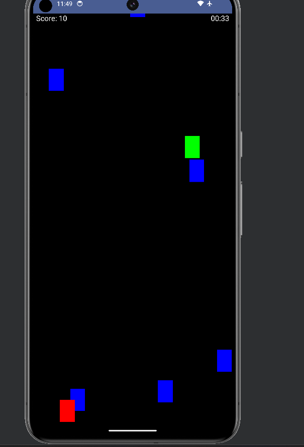

# TAP'N'SCORE
## Introduction:
   A simple yet fun game made in jetpackcompose acitivity using kotlin, in this game a player is tasked with tapping as many square as possible within one minute.
## HOW IT WORKS(WORKFLOW)
   - A PLAYER ENTERS GAME AND THEN HE IS SHOWN MENU SCREEN WHERE HE IS GIVEN OPTION OF:
   
         - PLAY->TO PLAYGAME
         - SHOW SCORE-> TO VIEW TOP 5 SCORE
         - INSTRUCTION-> HOW TO PLAY GAME
         
   - WHEN HIT PLAY A PLAYER TAPS THE RECTANGLES AND IS REWARDED +2 POINTS FOR EACH CORRECT TAP
   - FAILURE TO HIT RECTANGLE AND ACCIDENTLLY HIT EMPTY SCREEN -1 POINT WILL BE DEDUCTED
   - THE GAME WILL END WHEN TIMER HIT 60 SEC OR 1:00 MIN
   - THE PERSON IS SHOWN THE TEXTBOX TO ENTER THEIR NAMES
   - IF THE SCORE IS GREATER THAN ANY OF THE EXISTING TOP FIVE SCORES IT WILL BE SAVED AND SHOWN.

## HOW IT SAVES
    THE DATABASE USED IN THIS GAME IS sqlite A DB WHICH ALREADY EXIST IN EVERY ANDROID DEVICES AND ABLE TO SAVE DATA LOCALLY OFFLINE.

## IMAGES
MENU SNAP

SCORE SNAP

INSTRUCTIONS

GAMEPLAY SNAP

GAME0OVER SCREEN

ENTER YOUR NAME

## 
